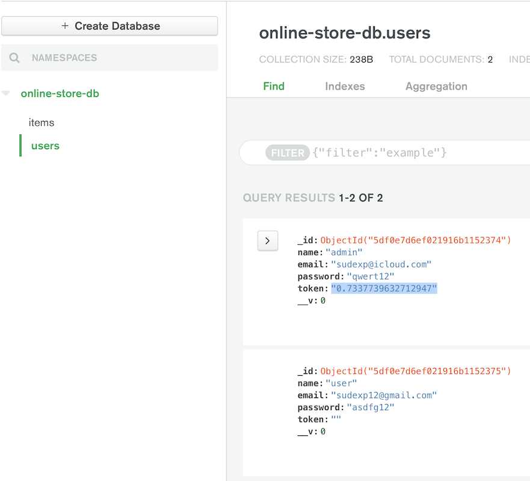

## Online Store / mobile project

***The purpose of the project:*** to deepen knowledge in the field of React Native technologies, to develop and implement a mobile application according to the [GitLab course instructions](https://gitlab.labranet.jamk.fi/TTOW0635/Mobile-Project).  

The desktop version of the project was implemented as a part of a web project and available at ***[my GitHub Pages](https://sudexp.github.io/online-store/build/)***. It was realized using JavaScript library for building user interfaces [ReactJS](https://reactjs.org/) and based on ***[fluidui prototypes](https://www.fluidui.com/editor/live/preview/cF9Ddm5UcTRCVjlTSDdoV3RzYWRwMDh5eEdsbXpvZFZweQ==)***.  

The purpose of this project is the implementation of a ***mobile online store app*** using the following technologies:  

- [React Native](https://facebook.github.io/react-native/) as a UI platform  
- [Redux](https://redux.js.org/) as a predictable state container  
- [Redux Thunk](https://github.com/reduxjs/redux-thunk/) as the recommended middleware for basic Redux side effects logic  

**[REST API](https://github.com/sudexp/mobile-project-api)** for this project was implemented using the following technologies:
- [NodeJS](https://nodejs.org/en/) as an open source server environment  
- [Express](https://expressjs.com/) as Node.js web application framework  
- [MongoDB](https://www.mongodb.com/) as a database  
- [Mongoose](https://mongoosejs.com/) as a MongoDB object modeling tool designed to work in an asynchronous environment.  

**To run project:**

First step:
- download or clone [REST API](https://github.com/sudexp/mobile-project-api) project
- run *npm install* in a command line
- run *nodemon* (or *npm run devstart* if you do not have [nodemon](https://www.npmjs.com/package/nodemon) installed globally) in command line

Second step:
- download or clone this project
- run *npm install* in a command line
- run *npm run ios* or *npm run android* in command line (depending on which simulator you want to run)

**Basic information**

The project was deployed using the [React Native CLI](https://www.npmjs.com/package/react-native-cli).

The project was implemented in 2 steps: 
- first step included the using only dummy data and models
- second step was to connect the frontend part with the previously made [REST API](https://github.com/sudexp/mobile-project-api)

The application is designed and works on all mobile devices IOS and Android. Styling is thought out taking into account the used platform and differs in colors and built-in components (buttons, icons, etc.).

The application starts with [StartScreen](screens/LoginScreen.js), where text (by default is "Online Store") bliks for 4 seconds:


Blinking is implemented in the [BlinkingText.js](components/BlinkingText.js) component using javascript function ***setInterval()***. 
```
// compoonents/BlinkingText.js
useEffect(() => {
  const interval = setInterval(() => {
    setShowText(previousShowText => !previousShowText);
  }, 750);

  return () => clearInterval(interval);
}, []);
```

Automatic redirect to [LoginScreen](screens/LoginScreen.js) is performed by the ***setTimeout()*** function:
```
// screens/StartScreen.js
useEffect(() => {
  setTimeout(() => {
    navigation.navigate('Login');
  }, 4000);
}, [navigation]);
```

At this stage, the form with email and password fields is blank and the "Login" button is inactive:


Form is made with the using [Formik](https://jaredpalmer.com/formik/) library, that helps with the 3 most annoying parts:
- getting values in and out of form state
- validation and error messages
- handling form submission.

If user enters invalid data or leaves any of the fields blank, he will receive a prompt and the submit button will remain inactive:


Data validation is performed using JavaScript object schema validator and object parser [Yup](https://github.com/jquense/yup):
- for "Email" field the valid value is x@x.x
- for "Password" field the valid value is any characters that must be at least 5.

If user enters valid but incorrect data (an unregistered value pair in the database), he will receive an alert window with the corresponding message:


User can also access the (SignupScreen[screens/SignupScreen.js]) by clicking on the link below the “Submit" button:


However, there is no user registration in the application: this screen has a link to the *LoginScreen* to ensure that the application is responsive.

If user enters an email address and password registered in the database, he will be automatically redirected to the [CollectionScreen](screens/CollectionScreen.js) after clicking the "Login" button, that becomes active:


Behind the scenes, after clicking the "Login" button, a connection to the database is made - POST request is sent:
```
// screens/LoginScreen.js
const handleLogin = async ({ email, password }, actions) => {
    setError(null);
    try {
      await dispatch(addUser(email, password));
      actions.resetForm();
      navigation.navigate('Collection');
    } catch (err) {
      setError(err.message);
    } finally {
      actions.setSubmitting(false);
    }
  };
  
// actions/auth.js
export const addUser = (email, password) => async dispatch => {
  const response = await fetch('http://localhost:3000/api/auth', {
    method: 'POST',
    headers: { 'Content-Type': 'application/json' },
    body: JSON.stringify({
      email,
      password,
    }),
  });
...
};
```

If user is registered in the database, a token is initialized and sent together with responce 200 to client:



In the application, token is added to Redux auth state and used inn future for sending POST requests to the database:


```
// reducers/auth.js
import { ADD_USER } from '../actions/auth';
import Auth from '../../models/auth';

const initialState = {
  user: {},
};

export default (state = initialState, action) => {
  switch (action.type) {
    case ADD_USER:
      const user = new Auth(
        action.user.email,
        action.user.password,
        action.user.token,
      );

      return {
        ...state,
        user: user,
      };

    default:
      return state;
  }
};
```

When the [CollectionScreen](screens/CollectionScreen.js) is downloaded, a request for a list of products is made:
```
// actions/items.js
export const fetchItems = () => async dispatch => {
  try {
    const response = await fetch('http://localhost:3000/api/collection');

    if (!response.ok) {
      const errorResponceData = await response.json();
      
      throw new Error('Something went wrong!');
    }

    const responseData = await response.json();

    dispatch({
      type: FETCH_ITEMS,
      items: responseData.data,
    });
  } catch (err) {
    throw err;
  }
};
```

And items are added to Redux state after receiving response 200 and data from the server:
```
// reducers/items.js
import { FETCH_ITEMS } from '../actions/items';

const initialState = {
  items: [],
};

export default (state = initialState, action) => {
  switch (action.type) {
    case FETCH_ITEMS:
      return {
        ...state,
        items: action.items,
      };

    default:
      return state;
  }
};
``` 


On the *CollectionScreen* user has three options:
- view item details
- add an item to cart
- to go to the cart.

The first of these options is implemented by clicking on "View Details" button, which redirects user to the [ItemDetailsScreen](screens/ItemDetailScreen.js):
```
// screens/Collection.js
<ItemDetail
   image={item.image}
   brand={item.brand}
   price={item.price}
   viewDetails={() => {
     navigation.navigate('ItemDetail', {
       itemId: item._id,
       itemBrand: item.brand,
     });
   }}
...           
/>
```


From this screen, user can either return to the previous one through the left button of navigation header bar or add an item to cart by clicking on "Add to Cart" button. Similarly, user can add an item on the *CollectionScreen*.

The logic for adding items to the cart is as follows:
- if there is already the same item in the cart, its quantity increases
- otherwise, a new product is added
- the total sum of items of the same brand and total price of all items in the cart are calculated at the same time.
```
// reducers/cart.js
case ADD_TO_CART:
  const orderId = action.orderId;
    const addedItem = action.item;
    const itemPrice = addedItem.price;
    const itemBrand = addedItem.brand;

    // check if this item already in the cart
    if (state.items[addedItem._id]) {
      const updatedCart = new Cart(
        state.items[addedItem._id].quantity + 1,
        itemPrice,
        itemBrand,
        state.items[addedItem._id].sum + itemPrice,
      );

      return {
        ...state,
        orderId,
        items: {
          ...state.items,
          [addedItem._id]: updatedCart,
        },
        totalPrice: state.totalPrice + itemPrice,
      };
    } else {
      const newCart = new Cart(1, itemPrice, itemBrand, itemPrice);

      return {
        ...state,
        orderId,
        items: {
          ...state.items,
          [addedItem._id]: newCart,
        },
        totalPrice: state.totalPrice + itemPrice,
      };
    }
```

The option "moving to cart" can be done by clicking on the trash icon on right side of navigation header bar, after which [CartScreen](screens/CartScreen.js) opens. Initially, cart is empty:
 
 


```
// reducers/cart.js
const initialState = {
  orderId: null,
  items: {},
  totalPrice: 0,
};
```

In this state of cart total price is equal to 0 and the button "Order Now" is not available for pressing. User can only return to the *CollectionScreen* via the navigation header bar.

After adding items to the cart, СartScreen looks as follows:


Now, in addition to returning to the previous screen, user has option of removing items from cart (by pressing on trash icon) and implementing order (by pressing on the "Order Now" button). 

When items remove from the cart, the following logic is followed:
- if the number of goods of a certain brand is more than 1, after each clicking on the trash icon the number of goods is reduced by 1
- otherwise, the product line is deleted completely
- the total sum of items of the same brand and total price of all items in the cart are calculated at the same time:
```
// actions/cart.js
case REMOVE_FROM_CART:
  const selectedItem = state.items[action.itemId];
  const selectedItemQuantity = selectedItem.quantity;
  let updatedItems;
  
  // check if this item need to reduce or remove
  if (selectedItemQuantity > 1) {
    const updatedItem = new Cart(
      selectedItem.quantity - 1,
      selectedItem.itemPrice,
      selectedItem.itemBrand,
      selectedItem.sum - selectedItem.itemPrice,
    );
    updatedItems = { ...state.items, [action.itemId]: updatedItem };
  } else {
    updatedItems = { ...state.items };
    delete updatedItems[action.itemId];
  }

  return {
    ...state,
    items: updatedItems,
    totalPrice: state.totalPrice - selectedItem.itemPrice,
  };
```

*CartScreen* after reducing a certain amount of items:


If user eventually removes all items, CartScreen will return to its initial state.

After selecting items and clicking on "Order Now" button, user will be redirected to the [SubmitOrderScreen](screens/SubmitOrderScreen.js), where he has an option of either going back to the *CartScreen* to edit the order by clicking on the "Cancel" button (or via navigation header bar) or filling out the form and confirming the order by clicking on the "Submit" button (innitially innactive):


```
// screes/CartScreen.js
<Button
  color={Colors.valid}
  title="Order Now"
  disabled={cartItemsArray.length === 0}
  onPress={() => {
    dispatch(addOrder(cartItems, cartTotalPrice));
    navigation.navigate('SubmitOrder');
  }}
/>
```

The form is implemented using Formik and libraries (same as LoginScreen form). All form fields must be filled in + each field has individual validation parameters:
- Full Name >= 2 characters
- Phone Number = 10 digits
- ZIP Code = 5 digits
- City >= 2 characters
- Address Line >= 10 characters

Unvalid or blank form fields are reported to user:


A validly filled form:


After filling in the form with valid data annd pressinng "Submit" button, user is redirected to the last [ConfirmScreen](screens/ConfirmOrderScreen.js) of the applicatio:

 


On this screen, user can see the details that were specified on the previous screen, as well as two buttons: one to go to the CollectionScreen, the other to sign up.
