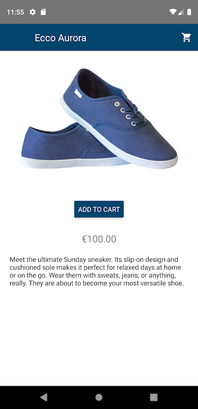

## Online Store / mobile project

***The purpose of the project:*** to deepen knowledge in the field React Native technologies, to develop and implement a mobile application "online store" according to the [GitLab course instructions](https://gitlab.labranet.jamk.fi/TTOW0635/Mobile-Project).  

The desktop version of the project was implemented as part of a web project and is available at ***[my GitHub Pages](https://sudexp.github.io/online-store/build/)***. It was realized using JavaScript library for building user interfaces [ReactJS](https://reactjs.org/) and based on ***[fluidui prototypes](https://www.fluidui.com/editor/live/preview/cF9Ddm5UcTRCVjlTSDdoV3RzYWRwMDh5eEdsbXpvZFZweQ==)***.  

The purpose of this project is the implementation of a *mobile online store app* using the following technologies:  

- [React Native](https://facebook.github.io/react-native/) as a UI platform  
- [Redux](https://redux.js.org/) as a predictable state container  
- [Redux Thunk](https://github.com/reduxjs/redux-thunk/) as the recommended middleware for basic Redux side effects logic  

**[REST API](https://github.com/sudexp/mobile-project-api)** for this project was implemented using the following technologies:
- [NodeJS](https://nodejs.org/en/) as an open source server environment  
- [Express](https://expressjs.com/) as Node.js web application framework  
- [MongoDB](https://www.mongodb.com/) as a database  
- [Mongoose](https://mongoosejs.com/) as a MongoDB object modeling tool designed to work in an asynchronous environment.  

**To run project:**

First step:
- download or clone [REST API](https://github.com/sudexp/mobile-project-api)
- run *npm install* in a command line
- run *nodemon* (or *npm run devstart* if you do not have [nodemon](https://www.npmjs.com/package/nodemon) installed globally) in command line

Second step:
- download or clone this project
- run *npm install* in a command line
- run *npm run ios* or *npm run android* in command line (depending on which simulator you want to run)

**Basic information**

The project was deployed using the [React Native CLI](https://www.npmjs.com/package/react-native-cli).

The project was implemented in 2 steps: 
- first step included the use only dummy data and models
- second step was to connect the frontend part with the previously made [REST API](https://github.com/sudexp/mobile-project-api)

The application is designed and works on all mobile devices IOS and Android. Styling is thought out taking into account the used platform and differs in colors and built-in components (buttons, icons, etc.).

The logical scheme of the application starts with the welcome screen, where the text used to indicate the name of the online store (by default is "Online Store") flashes for 4 seconds, after which the user is redirected to the authorization screen:

Android: 

iOS: 

If the user enters an email address and password registered in the database, he will be automatically redirected to the CollectionScreen after clicking the submit button:

Android: 

iOS: 

If the user enters invalid data or leaves any of the fields blank, he will receive a prompt and the submit button will remain inactive:

Android: 

iOS: 

If the user enters valid but incorrect data (an unregistered value pair in the database), he will receive an alert window with the corresponding message:

iOS: 

The user can also access the SignupScreen by clicking on the link below the “Submit" button:

Android: 

iOS: 

However, there is no user registration in the application: this screen has a link to the LoginScreen to ensure that the application is responsive.

After completing the registration stage on the CollectionScreen, the user has three options:
- view item details
- add an item to cart
- to go to the cart.

The first of these features is implemented by clicking on the "View Details" button, which redirects the user to the ItemDetailsScreen.

Android: 

iOS: 

From this screen, user can either return to the previous one through the left button of the navigation header bar or add an item to cart by clicking on "Add to Cart" button. Similarly, user can add an item on the CollectionScreen.

The logic for adding items to the cart is as follows:
- if there is already the same item in the cart, its quantity increases
- otherwise, a new product is added
- the total sum of items of the same brand and total price of all items in the cart are calculated at the same time.

The option "moving to cart" can be done by clicking on the trash icon on the right side of the navigation header bar, after which the CartScreen opens. Initially, cart is empty:

Android: 

iOS: 

In this state of cart total price is equal to 0 and the button "Order Now" is not available for pressing. User only can return to the CollectionScreen via the navigation header bar.

After adding items to the cart, СartScreen looks as follows:

Android: 

iOS: 

Now, in addition to returning to the previous screen, the user has the option of removing items from the cart (by pressing on the trash icon) and implementing the order (by pressing on the "Order Now" button). 

When removing items from the cart, the following logic is followed:
- if the number of goods of a certain brand is more than 1, after each clicking on the trash icon the number of goods is reduced by 1
- otherwise, the product line is deleted completely
- the total sum of items of the same brand and total price of all items in the cart are calculated at the same time.

CartScreen after reducing a certain amount of items:

Android: 

iOS: 

If user eventually removes all items, CartScreen will return to its initial state.

After selecting items and clicking on "Order Now" button, user will be redirected to the SubmitOrderScreen, where he has an option of either going back to the shopping cart to edit the order by clicking on the "Cancel" button or through the navigation header bar or filling out the form and confirming the order by clicking on the "Submit" button.

All SubmitForm fields must be filled in + each field has individual validation parameters:
- Full Name >= 2 characters
- Phone Number = 10 digits
- ZIP Code = 5 digits
- City >= 2 characters
- Address Line >= 10 characters

Unvalid or blank form fields are reported to the user:

Android: 

iOS: 

A validly filled form:

Android: 

iOS: 

After filling in the form with valid data, the user is redirected to the last ConfirmScreen of the application, where user can check the correctness of the data specified by him, return to CollectionScreen or exit the application:

Android: 

iOS: 

